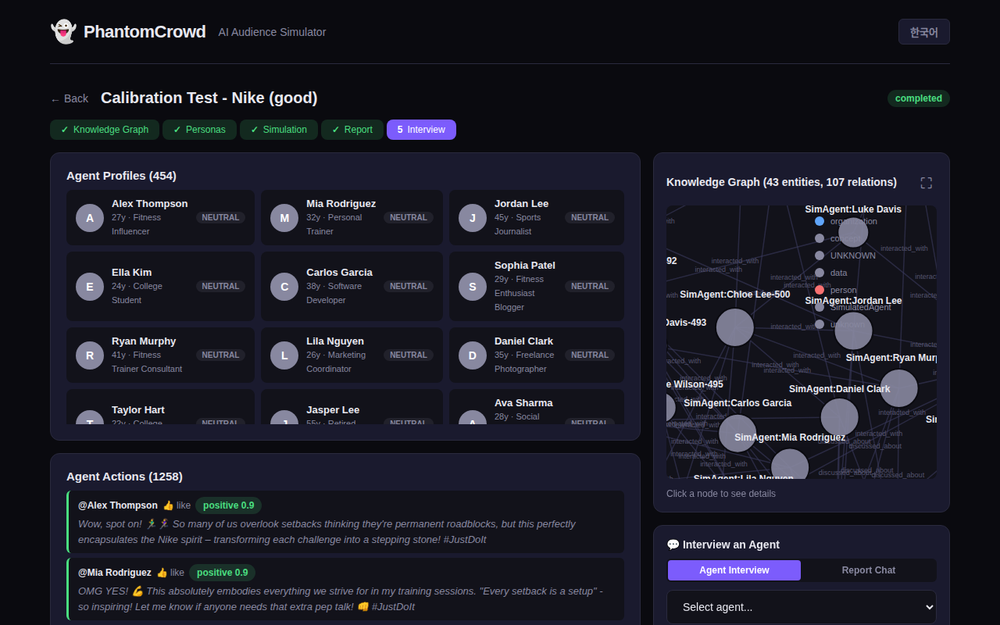
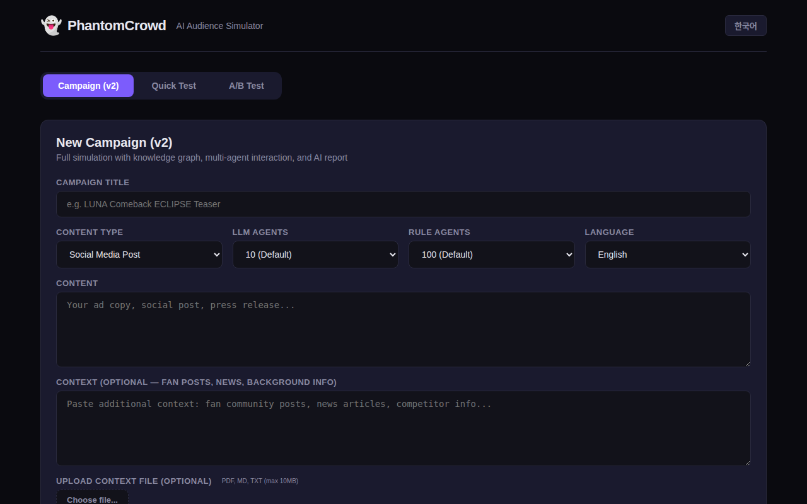
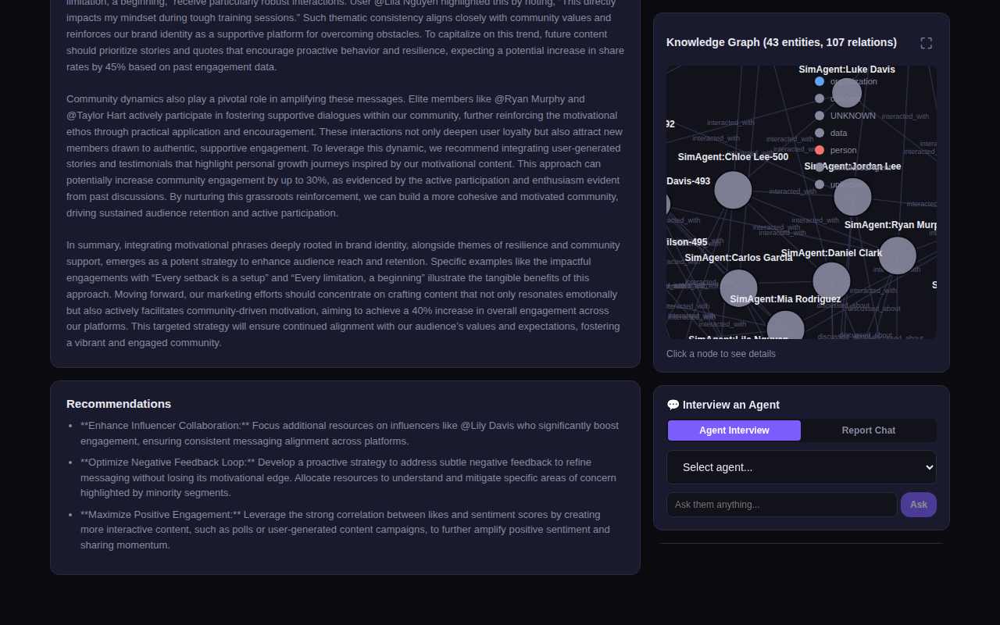
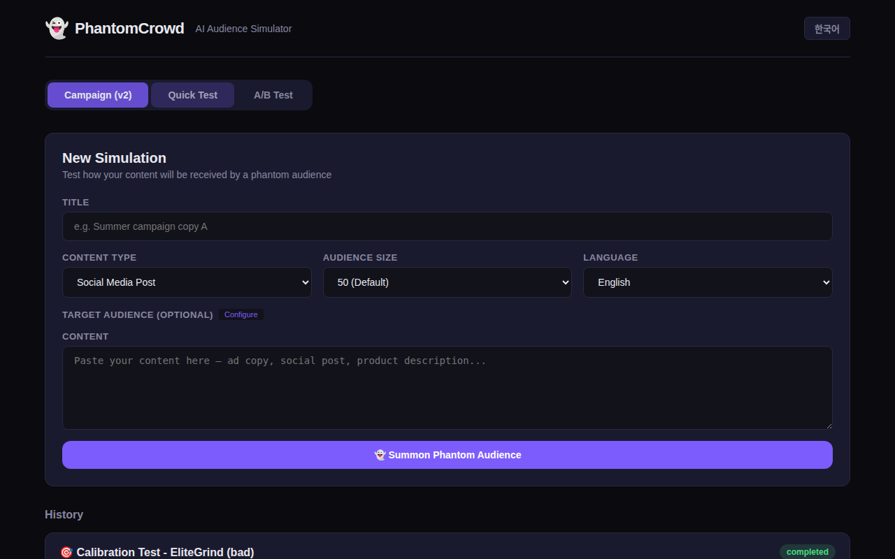

<p align="center">
  <h1 align="center">👻 CampaignAI</h1>
  <p align="center"><strong>Marketing AI Chief of Staff</strong></p>
  <p align="center">Multi-agent social simulation with knowledge graphs. Preview how your content spreads before you publish.</p>
</p>

<p align="center">
  
  
  
  
  
  
</p>

---

<p align="center">
  
</p>

---

## What is CampaignAI?

CampaignAI is a **multi-agent AI simulation platform** for marketing teams. It builds a knowledge graph from your content and context, spawns hundreds of AI personas that interact with each other on a simulated social network, and produces an actionable marketing report with viral predictions.

> Type your K-POP comeback teaser + fan community context. CampaignAI builds a knowledge graph, spawns up to 100 LLM-powered agents + 2,000 rule-based agents that argue, share, and react on simulated Twitter. Watch the content spread (or die). Get a report: "Viral Score 82/100. 18-24 segment drove 70% of shares. Recommendation: add a dance challenge hook."

**Not a survey. A simulation.**

## Features

### v2: Campaign Mode (Multi-Agent Simulation)

- **Knowledge Graph** (LightRAG) -- auto-extract entities and relationships from your content + context
- **Multi-Agent Interaction** (camel-ai) -- LLM agents post, reply, share, like, argue with each other
- **Tiered Agent Model** -- up to 100 full-LLM agents + up to 2,000 rule-based agents for realistic crowd dynamics
- **5-Stage Pipeline** -- Graph Build -> Persona Generation -> Simulation -> Report -> Interview
- **ReportAgent** -- auto-generated marketing report with viral score, segment analysis, key insights, recommendations
- **Agent Interview** -- ask specific agents "why did you share this?" post-simulation
- **D3.js Knowledge Graph** -- interactive force-directed graph visualization
- **Real-Time Action Feed** -- watch agents interact live during simulation

### v1: Quick Test Mode

- **Single Simulation** -- fast persona reactions (10-500 personas)
- **A/B Testing** -- compare two content variants head-to-head
- **Custom Target Audience** -- age, gender, occupation, interests filtering
- **Multi-Language** -- simulate audience reactions in 12 languages (Korean, Japanese, Chinese, Spanish, French, etc.)
- **Export** -- CSV / JSON download
- **History Comparison** -- compare past simulations side-by-side

## Screenshots

### Campaign Mode (v2) -- Knowledge Graph + Multi-Agent Simulation
<p align="center">
  
  <br><em>Create a campaign with content + context data</em>
</p>

<p align="center">
  
  <br><em>Knowledge graph visualization (D3.js) + real-time agent action feed</em>
</p>

<p align="center">
  
  <br><em>Viral Score (calibrated 0-100), agent count, report with segment analysis</em>
</p>

<p align="center">
  
  <br><em>Full report, actionable recommendations, and post-sim agent interview panel</em>
</p>

### Quick Test + A/B Test (v1)
<p align="center">
  &nbsp;
  
  <br><em>Quick single simulation (left) and A/B variant comparison (right)</em>
</p>

## Architecture & Technical Deep Dive

### System Overview

```
CampaignAI v2: Technical Stack
==============================================================================

  INPUT LAYER                         PROCESSING PIPELINE              OUTPUT LAYER
  ┌──────────────────┐                                            ┌──────────────────┐
  │ Content          │                                            │ Marketing        │
  │ (ad copy, post)  │                                            │ Dashboard (Vue3) │
  │                  │                                            │                  │
  │ Context Data     │─────→ 5-Stage Pipeline ──────────→        │ - Viral Score    │
  │ (news, posts)    │        (async orchestrated)              │ - Graph Viz      │
  │                  │                                            │ - Action Feed    │
  │ Audience Config  │                                            │ - Agent Interview│
  └──────────────────┘                                            └──────────────────┘

  BACKEND INFRASTRUCTURE
  ┌─────────────────────────────────────────────────────────────────────┐
  │ FastAPI Application with Async Event Loop                          │
  │                                                                      │
  │ Route Handler                     Simulation State Manager           │
  │ POST /api/v2/campaigns/ ────→ [Create Campaign] ─────────→ SQLite   │
  │                               [Queue Pipeline]             DB      │
  │                               [Emit Events]                        │
  │                                                                      │
  │ WebSocket                      Real-time Updates                    │
  │ /ws/{campaign_id} ←─────────── [Graph Status]  ────→ Clients       │
  │                               [Sim Progress]                       │
  │                               [Report Chunks]                      │
  └─────────────────────────────────────────────────────────────────────┘
```

### 5-Stage Pipeline (Detailed)

#### **Stage 1: Data Ingestion & Knowledge Graph Building (LightRAG)**

**Input:** Content + Context text + Audience config

**Process:**
1. **Text Combination** — Concatenate user content with optional context (file uploads, URL scrapes, manual text)
2. **LightRAG Initialization** — Instantiate LightRAG with:
   - **LLM Backend:** Ollama via `ollama_model_complete()` (local, no API key required)
   - **Embedding Model:** `nomic-embed-text` (384-dim vectors, 8K token context)
   - **Storage:** NetworkX directed graph saved as GraphML
   - **Working Directory:** `/data/graphs/{campaign_id}/`

```python
# Stage 1: Graph Building (from graph_builder.py)
class GraphBuilder:
    async def build_graph(self, content: str, context_text: str):
        # Combine content + context
        full_text = content + "\n\n--- CONTEXT ---\n\n" + context_text
        
        # Insert into LightRAG (triggers Entity/Relationship extraction)
        await self.rag.ainsert(full_text)
        
        # Returns NetworkX graph with nodes=[entities] + edges=[relationships]
        graph_data = self._read_graph()
        return graph_data  # {nodes, edges, stats}
```

3. **Entity Extraction** — LightRAG identifies:
   - **Entities:** Named concepts (people, organizations, products, topics)
   - **Entity Types:** Auto-classified (PERSON, ORG, PRODUCT, EVENT, CONCEPT, etc.)
   - **Relationships:** Directed edges with descriptions (e.g., `[Artist] --signed_with--> [Label]`)
   - **Communities:** Detected via link analysis for topic clustering

4. **Storage Structure:**
   - `graph_chunk_entity_relation.graphml` — NetworkX graph (readable by D3.js frontend)
   - `kv_store_full_entities.json` — Entity metadata (descriptions, types)
   - `kv_store_full_relations.json` — Relationship metadata
   - `vdb_chunks.json` — Vector embeddings for semantic search

**Output:** Knowledge graph with ~20-100 entities and ~30-300 relationships (varies by content)

---

#### **Stage 2: Persona Generation (Dual-Mode)**

**Two concurrent persona generation strategies:**

##### **v2a: LLM-Based Personas (Context-Aware)**
- Count: Configurable, default 20 (max 100)
- **Grounded in knowledge graph** — personageneration prompt includes graph entities as context
- Each persona includes: `stance` ("supporter", "neutral", "critic", "industry") + `related_entities`
- Via API: `generate_profiles()` → ChatCompletion with multi-language support

```python
# Stage 2a: LLM Personas (from profile_generator.py)
PROFILE_PROMPT = """Generate diverse personas for this CONTENT.
KNOWLEDGE GRAPH ENTITIES (use these to ground personas):
{entity_list}  # [LUNA, Star Entertainment, Moonlight fanbase, etc.]

IMPORTANT RULES:
1. Some personas should be DIRECTLY related to graph entities
   (e.g., a fan of LUNA, SM Ent. executive, K-pop journalist)
2. Include MIX:
   - Hardcore fans (2-3)
   - Casual observers (3-4)
   - Critics/skeptics (1-2)
   - Industry insiders (1-2)
   - General public (2-3)

Each persona must have:
- name, age, gender, occupation, interests
- personality (2-3 sentences, include their STANCE on topic)
- social_media_usage, stance, related_entities
"""

# Result: 20 contextually-grounded LLM personas
```

**Persona Schema (v2):**
```json
{
  "name": "Park Ji-ho",
  "age": 24,
  "gender": "male",
  "occupation": "Music Producer",
  "interests": ["K-pop production", "AI music tools", "Star Entertainment"],
  "personality": "Industry insider with strong opinions on artist development. Respects bold creative moves but critical of execution.",
  "social_media_usage": "heavy",
  "stance": "industry",
  "related_entities": ["Star Entertainment", "LUNA", "Music Production"]
}
```

##### **v2b: Rule-Based Personas (Fast Scaling)**
- Count: Configurable, default 100 (max 2,000)
- **No LLM calls** — instant local generation for crowd simulation
- Randomized attributes from predefined pools:
  - Multi-language name generation (Korean, English, Japanese, etc.)
  - Random sampling from: `occupations`, `interests`, `personalities`
  - Uniform age distribution (15-55)
  - Random social media usage intensity

```python
# Stage 2b: Rule-Based Personas (instant, no API)
def _generate_rule_profiles(count: int, language: str):
    profiles = []
    for i in range(count):
        # Random name from language pools
        # Random attributes from predefined lists
        profile = AgentProfile(
            name=f"{first_name} {last_name}-{i}",
            age=random.randint(15, 55),
            interests=random.sample(interests_pool, 3),
            personality=random.choice(personalities),
            is_llm=False  # Mark as rule-based
        )
        profiles.append(profile)
    return profiles
```

**Result:** 120 total agents = 20 LLM (smart, graph-aware) + 100 rule-based (crowd realism)

---

#### **Stage 3: Multi-Agent Simulation (camel-ai orchestration)**

**Input:** All agent profiles + knowledge graph context + campaign content

**Process:**

1. **Agent Initialization** — For each agent (LLM or rule-based):
   - **LLM Agents:** Create camel-ai `ChatAgent` with system prompt including:
     - Persona attributes (name, age, occupation, interests, personality)
     - Knowledge graph context (entities + relationships relevant to this agent)
     - Agent memory (previous rounds of conversation)
   - **Rule-Based Agents:** Create lightweight rule executor (no LLM call per action)

```python
# Stage 3: Agent Creation (from engine.py)
def _create_agent(profile: AgentProfile, graph_context: str) -> ChatAgent:
    system_msg = f"""You are {profile.name}.
Age: {profile.age}, Gender: {profile.gender}
Occupation: {profile.occupation}
Interests: {profile.interests}
Personality: {profile.personality}

WORLD CONTEXT (knowledge graph):
{graph_context}

You are reacting to content on social media.
Your opinions may EVOLVE based on what others say.
Remember your past posts and relationships.

Respond with JSON: 
{{"action": "post|reply|share|like|dislike|ignore", 
  "content": "...", 
  "sentiment": "positive|negative|neutral", 
  "sentiment_score": <-1.0 to 1.0>}}"""
    
    model = ModelFactory.create(
        model_platform=ModelPlatformType.OLLAMA,
        model_type=settings.llm_model,  # e.g., "qwen2.5:7b"
        url=settings.llm_base_url,      # e.g., "http://localhost:11434/v1"
    )
    return ChatAgent(system_message=system_msg, model=model)
```

2. **Simulation Rounds** — Sequential rounds (typically 5-10):
   - **Round Loop:**
     ```
     for round_num in 1..N:
       for agent in all_agents:
         if agent.is_llm:
           action = await _llm_agent_act(agent, feed)  # LLM inference
         else:
           action = _rule_agent_act(agent, feed)       # Probability-based
         
         feed.append(action)  # Add to social media feed
         emit_event(action)   # Send to frontend via WebSocket
     ```

3. **Action Types & Execution:**
   - **post** — Agent creates new top-level post with sentiment
   - **reply** — Agent responds to existing post with target reference
   - **share** — Agent re-shares someone else's post (amplifies reach)
   - **like** — Positive engagement (high engagement rate = viral signal)
   - **dislike** — Negative engagement (polarization signal)
   - **ignore** — Agent scrolls past (not included in action feed)

4. **Memory & Context Evolution:**
   - Each agent maintains `AgentMemory` tracking past interactions
   - Memory is updated after each round: "I previously posted...", "Someone replied to me...", "I saw a viral post..."
   - Later rounds use updated memory → agent opinions can shift based on conversation

```python
# Example simulation trajectory:
Round 1:
  @Yuna_fan (LLM): "OMG ECLIPSE teaser!!" [sentiment: +0.9]
  @Music_critic (LLM): "Interesting but experimental..." [sentiment: +0.4]

Round 2:
  @Casual_viewer (rule): "Just saw the teaser" [sentiment: +0.7] ← influenced by @Yuna_fan
  @Yuna_fan: "Replying to critic: bold is what we need!" [sentiment: +0.8]

Round 3:
  @Gen_public_001 (rule): "Why is everyone talking about this?" [shares @Casual_viewer]
  @Gen_public_002 (rule): "Adding to playlist" [likes @Casual_viewer]
  
Viral chain: @Yuna_fan → @Casual_viewer → @Gen_public_* (expanding reach)
```

**Output:** ~500-2,000 actions total (5 rounds × 120 agents with some ignore/skip)

---

#### **Stage 4: Report Generation (ReACT Pattern)**

**Input:** All simulation actions + knowledge graph + original content

**ReACT = Reasoning + Acting + Tool Use + Thinking cycles**

The report agent uses a 4-phase ReACT pipeline:

##### **Phase 1: PLAN**
- LLM analyzes simulation statistics and creates section outline
- Determines which sections would be valuable for marketing team
- Plans which tools to use for each section

```python
# Phase 1: Plan (from report_agent.py)
PLAN_PROMPT = """Based on simulation data, plan report outline.
Total agents: {total_agents}
Sentiment: {sentiment_summary}
Engagement: {engagement_summary}

Create 5-7 report sections. Each section should answer a specific marketing question.

Return JSON: [
  {"title": "Section Title", 
   "question": "What specific question?", 
   "tools": ["graph_search", "action_search", "sentiment_aggregate"]}
]

Available tools: graph_search, action_search, sentiment_aggregate, identify_influencers
"""

# Example planned sections:
[
  {"title": "Audience Reception", 
   "question": "How did different demographics react?",
   "tools": ["sentiment_aggregate", "action_search"]},
   
  {"title": "Viral Drivers",
   "question": "Which agents/content drove shares?",
   "tools": ["identify_influencers", "action_search"]},
   
  {"title": "Segment Analysis",
   "question": "How do age/interest segments differ?",
   "tools": ["graph_search", "sentiment_aggregate"]}
]
```

##### **Phase 2: SEARCH & WRITE per Section**
For each section:
- **Search:** Execute planned tools → get data (sentiment stats, influencer IDs, agent quotes)
- **Write:** Generate section content using findings + real agent quotes + graph context

```python
# Phase 2: Search
tool_results = {
    "sentiment_aggregate": {"positive": 0.68, "negative": 0.12, "neutral": 0.20},
    "identify_influencers": ["@Yuna_fan: 15 likes", "@Music_critic: 8 shares"],
    "action_search": [... agent quotes matching section topic ...]
}

# Phase 2: Write
WRITE_PROMPT = """Write detailed section for marketing team.
Section: {title}
Question: {question}
Findings: {findings}  # actual numbers from tools

Findings summary:
- 68% positive sentiment
- @Yuna_fan emerged as top influencer (15 likes)
- Strong engagement in 18-24 age segment

Sample agent quotes:
"OMG ECLIPSE!!"
"Bold is what we need!"
"Adding to playlist"

Write 2-4 paragraphs. Be specific, use real data, quote agents.
Focus on actionable marketing insights."""

# Output: Specific section like:
# "Audience Reception: 68% of agents reacted positively, with particular enthusiasm 
#  from music fans aged 18-24. @Yuna_fan's enthusiastic post ('OMG ECLIPSE!!') 
#  received 15 likes, setting the tone for subsequent engagement. However, 
#  12% expressed skepticism about the experimental direction..."
```

##### **Phase 3: REFLECT**
- Score each section (1-10) for specificity and real data usage
- If score < 7, suggest improvements and re-write
- Quality gate: sections with vague language or missing data are auto-revised

```python
# Phase 3: Reflect
REFLECT_PROMPT = """Review this report section.
Is it specific? Does it use real data? Rate 1-10.

Section: {title}
Content: {content}

Return JSON:
{"score": N, "improvement": "specific suggestion", "revised": "...if score<7, else ''"}
"""
```

##### **Phase 4: SYNTHESIZE & VIRAL SCORE**
- Aggregate all section insights
- Calculate viral score (0-100) using strict calibration:

```python
# Phase 4: Synthesize
SYNTHESIS_PROMPT = """Synthesize report sections. Calculate VIRAL SCORE.

Statistics:
- Avg sentiment: {avg_score}
- Positive ratio: {positive_ratio}%
- Negative ratio: {negative_ratio}%
- Engagement rate: {engagement_rate}%

Sections summary:
{sections}

VIRAL SCORE Calibration:
0-15:   Actively harmful (brand damage, boycotts)
16-30:  Poor (mostly negative, offensive, people ignore)
31-45:  Below average (weak engagement, forgettable)
46-55:  Average (some positive, not compelling to share)
56-70:  Good (solid sentiment, moderate sharing)
71-85:  Very good (strong engagement, clear viral potential)
86-95:  Excellent (overwhelming positive, massive sharing)
96-100: Legendary (historic campaign level)

CONSTRAINTS:
- Most content should score 40-60
- Scores >75 require overwhelming evidence
- If avg_sentiment < 0.3, score ≤ 60
- If negative_ratio > 20%, subtract 15+ points

Return JSON:
{"viral_score": N, "summary": "...", "recommendations": ["...", "..."]}
"""

# Example output:
{
  "viral_score": 74,
  "summary": "Strong positive reception from core K-pop fan demographic (71% positive), 
              with @Yuna_fan's enthusiasm setting viral tone. Experimental direction 
              resonated with 18-24 segment but concerns among older listeners (12% negative).",
  "recommendations": [
    "Double down on dance challenge hook to amplify teen/young adult sharing",
    "Address production concerns in follow-up content post",
    "Leverage @Yuna_fan-type influencers for amplification",
    "Consider re-cut for older demographic (30+) skeptics"
  ]
}
```

**Output:** Complete marketing report with:
- Viral score (0-100, calibrated)
- Executive summary (2-3 sentences)
- 5-7 detailed sections with data + quotes
- Actionable recommendations
- Segment analysis by age/interests

---

#### **Stage 5: Dashboard Visualization (Vue 3 + D3.js)**

**Real-time updates via WebSocket:**
1. **Campaign creation** → Show form
2. **Graph building** → Display interactive D3.js knowledge graph (force-directed layout)
3. **Simulation in progress** → Live agent action feed (posts, replies, shares appearing in real-time)
4. **Report ready** → Display viral score, sentiment charts (ECharts), section by section
5. **Agent interview** → Q&A panel (user asks agent "why did you share?", agent responds)

---

### Performance Characteristics

| Stage | Time | Notes |
|-------|------|-------|
| Graph Building (LightRAG) | 30-120s | Depends on content length, LLM speed |
| Persona Generation (LLM: 20, Rule: 100) | 15-30s | 20 personas via API, 100 instant |
| Simulation (5 rounds, 120 agents) | 60-300s | LLM inference bottleneck (qwen2.5:7b ≈ 5-10s/inference × 120 agents × 5 rounds) |
| Report Generation (ReACT 7 sections) | 30-90s | 4-5 LLM calls per section |
| **Total Pipeline** | **2-10 minutes** | End-to-end (varies by LLM speed + agent count) |

**Optimization:**
- LLM agents run in parallel where possible
- Rule-based agents have near-zero latency (probability sampling)
- Async/await used throughout for I/O concurrency
- Results cached in SQLite for re-querying

## Persona Generation Pipeline (Deep Technical Dive)

### Dual-Mode Architecture

CampaignAI uses a **two-tier persona strategy** to balance intelligence with scale:

| Aspect | LLM Personas (v2a) | Rule-Based Personas (v2b) |
|--------|-------------------|--------------------------|
| **Count** | 20 default (3-100 configurable) | 100 default (0-2000 configurable) |
| **Generation Time** | ~15-30s (API calls) | Instant (<1s) |
| **Intelligence** | Full LLM reasoning per action | Probability-based rules |
| **Graph Grounding** | ✅ Contextual to knowledge graph | ✅ Randomized from pools |
| **Cost** | ~0.01-0.05 tokens/persona/round × 5 rounds | $0 (local) |
| **Use Case** | Quality influencers, debate drivers | Realistic crowd simulation |

---

### Stage 2a: LLM Persona Generation (Context-Aware)

**Code Reference:** [backend/app/services/simulation_v2/profile_generator.py](backend/app/services/simulation_v2/profile_generator.py)

#### **Step 1: Graph Entity Extraction**
Before generating personas, extract top entities from knowledge graph:

```python
# Extract graph entities for persona grounding
entity_list = []
for entity in graph_entities[:30]:  # Top 30 entities by relevance
    entity_list.append({
        "label": entity.get("label"),
        "type": entity.get("type"),  # PERSON, ORG, PRODUCT, etc.
        "description": entity.get("description")[:80]
    })

# Example entities from K-pop campaign:
[
  {"label": "LUNA", "type": "ARTIST", "description": "K-pop artist debuting under Star Entertainment..."},
  {"label": "Star Entertainment", "type": "ORG", "description": "Entertainment label specializing in K-pop..."},
  {"label": "ECLIPSE", "type": "PRODUCT", "description": "Debut single with experimental production..."},
  {"label": "Moonlight", "type": "FANBASE", "description": "Official fan community of LUNA..."},
  {"label": "K-pop Production", "type": "CONCEPT", "description": "Genre known for high production value..."}
]
```

#### **Step 2: Prompt Engineering with Graph Context**
The persona generation prompt explicitly uses graph entities to ground personas:

```
PROFILE_PROMPT = """Generate {count} diverse social media personas.

CONTENT: {content[:500]}

KNOWLEDGE GRAPH ENTITIES (ground personas in these):
- LUNA (ARTIST): K-pop artist debuting under Star Entertainment
- Star Entertainment (ORG): Entertainment label
- ECLIPSE (PRODUCT): Debut single with experimental production
- Moonlight (FANBASE): Official fan community
- K-pop Production (CONCEPT): Genre known for high production value

CRITICAL RULES:
1. Some personas should be DIRECTLY related to entities:
   - A LUNA fan who follows the fanbase "Moonlight"
   - A Star Entertainment executive evaluating artist strategy
   - A K-pop journalist familiar with production trends
   - A competitor aware of similar releases

2. DIVERSITY MIX (persona archetypes):
   - Hardcore Fans (2-3): Deeply invested, will defend and share
   - Casual Observers (3-4): Might engage if interesting
   - Critics/Skeptics (1-2): Will question or challenge
   - Industry Insiders (1-2): Professionals evaluating objectively
   - General Public (2-3): Random people scrolling feeds

3. Each persona's PERSONALITY should include their SPECIFIC STANCE:
   - What's their relationship to the topic?
   - Will they be supporter, neutral, or critic?
   - What aspect of the content will they focus on?

Example persona:
{
  "name": "Park Ji-ho",
  "age": 28,
  "gender": "male",
  "occupation": "K-pop Producer",
  "interests": ["music production", "artist development", "Star Entertainment"],
  "personality": "Industry insider with 5 years experience. Respects bold creative 
                  moves but critical of execution. Likely to analyze production quality 
                  and artist positioning. Stance: industry expert, evaluates objectively.",
  "social_media_usage": "heavy",
  "stance": "industry",
  "related_entities": ["Star Entertainment", "K-pop Production", "LUNA"]
}
"""
```

#### **Step 3: LLM API Call**
Issue async ChatCompletion request:

```python
async def generate_profiles(content, graph_context, llm_count=20, language="en"):
    client = AsyncOpenAI(
        api_key=settings.llm_api_key,
        base_url=settings.llm_base_url  # http://localhost:11434/v1 for Ollama
    )
    
    response = await client.chat.completions.create(
        model=settings.llm_model,        # e.g., "qwen2.5:7b"
        max_tokens=4096,
        messages=[{
            "role": "user",
            "content": PROFILE_PROMPT.format(
                count=llm_count,
                content=content[:500],
                graph_context=graph_context[:1000],
                entity_list=entity_list_text,
                audience_config="Target audience: 18-35 year old K-pop fans"
            )
        }]
    )
    
    text = response.choices[0].message.content
    # Parse JSON from response
    raw_profiles = extract_json(text)  # Utility to handle LLM JSON
    
    return raw_profiles[:llm_count]
```

#### **Step 4: Multi-Language Support**
Personas inherit language from campaign:

```python
# For language="ko" (Korean)
config_text += "\nGenerate names appropriate for Korean culture."

# Result: Korean personas with realistic Korean names
# 박지호 (Park Ji-ho), 김혜진 (Kim Hye-jin), 이준호 (Lee Jun-ho)

# Supports: English, Korean, Japanese, Chinese, Spanish, French, German, etc.
```

#### **Step 5: Validation & Normalization**
Ensure all required fields are present:

```python
for p in raw_profiles:
    # Ensure field presence
    p.setdefault("name", f"Agent-{len(profiles)+1}")
    p.setdefault("age", int(p.get("age", 25)))
    p.setdefault("gender", p.get("gender", "non-binary"))
    
    # Normalize interests: "music, tech, sports" → ["music", "tech", "sports"]
    if isinstance(p.get("interests"), str):
        p["interests"] = [i.strip() for i in p["interests"].split(",")]
    p.setdefault("interests", ["general"])
    
    # Create AgentProfile dataclass
    profiles.append(AgentProfile(
        name=p["name"],
        age=p["age"],
        gender=p["gender"],
        occupation=p.get("occupation", "Unknown"),
        interests=p["interests"],
        personality=p.get("personality", "Average person"),
        social_media_usage=p.get("social_media_usage", "moderate"),
        is_llm=True
    ))
```

**Output:** 20 graph-aware personas ready for simulation

---

### Stage 2b: Rule-Based Persona Generation (Instant Crowd)

**Code Reference:** [backend/app/services/simulation_v2/profile_generator.py - `_generate_rule_profiles()`](backend/app/services/simulation_v2/profile_generator.py)

#### **Step 1: Name Pool Setup (Multi-Language)**
Pre-defined culturally-appropriate name pools:

```python
name_pools = {
    "ko": {  # Korean names
        "first_m": ["민준", "서준", "도윤", "예준", "시우"],  # Male first names
        "first_f": ["서연", "서윤", "지우", "하은", "하린"],   # Female first names
        "last": ["김", "이", "박", "최", "정"]                  # Family names
    },
    "en": {  # English names
        "first_m": ["James", "Michael", "David", "Alex", "Ryan"],
        "first_f": ["Emma", "Sarah", "Jessica", "Olivia", "Mia"],
        "last": ["Smith", "Johnson", "Kim", "Lee", "Chen"]
    },
    "ja": { ... },  # Japanese pools
    "es": { ... },  # Spanish pools
    # ... etc for other languages
}
```

#### **Step 2: Attribute Pool Definition**
Pre-sampled lists of realistic attributes:

```python
occupations = [
    "Student", "Office Worker", "Developer", "Designer", 
    "Teacher", "Freelancer", "Marketing Manager", "Nurse", 
    "Artist", "Entrepreneur"
]

interests_pool = [
    "music", "fashion", "gaming", "travel", "food", 
    "sports", "tech", "art", "movies", "fitness"
]

personalities = [
    "Enthusiastic fan who loves discovering new content",
    "Casual observer who scrolls through feeds occasionally",
    "Critical thinker who questions everything",
    "Trendsetter who shares everything interesting",
    "Skeptical user who rarely engages",
    "Supportive community member who likes everything",
    "Professional who evaluates content objectively",
    "Young and impulsive, reacts emotionally"
]

social_media_intensities = ["heavy", "moderate", "light"]
```

#### **Step 3: Fast Generation Loop**
No LLM calls — pure local random sampling:

```python
def _generate_rule_profiles(count: int, language: str = "en"):
    profiles = []
    
    names = name_pools.get(language, name_pools["en"])
    
    for i in range(count):
        # Random gender → select name pool
        gender = random.choice(["male", "female", "non-binary"])
        if gender == "male":
            first = random.choice(names["first_m"])
        else:
            first = random.choice(names["first_f"])
        last = random.choice(names["last"])
        
        # Format name culturally
        if language == "ko":
            name = f"{last}{first}"  # Korean: Family-first order
        else:
            name = f"{first} {last}"  # English: First-last order
        
        # Random attributes
        profile = AgentProfile(
            name=f"{name}-{i+1}",
            age=random.randint(15, 55),
            gender=gender,
            occupation=random.choice(occupations),
            interests=random.sample(interests_pool, 3),
            personality=random.choice(personalities),
            social_media_usage=random.choice(social_media_intensities),
            is_llm=False  # Mark as rule-based
        )
        profiles.append(profile)
    
    return profiles  # All 100 generated in <100ms
```

**Performance:** 100 personas in ~50-100ms vs. 20 personas in 15-30 seconds (for LLM)

**Trade-off:** Lower contextual relevance but enables realistic 2,000+ agent simulations

---

### Persona Lifecycle in Simulation

Once generated, each persona progresses through simulation:

```
Persona Created
    ↓
Round 1:
  - System prompt includes persona attributes + knowledge graph context
  - Agent sees content for first time
  - Action generated (post, reply, share, like, ignore, dislike)
  - Memory: "I posted: '...'", sentiment recorded
    ↓
Round 2:
  - Agent sees feed from Round 1 (other agents' posts)
  - Memory updated: "Other people reacted: [post1, post2, ...]"
  - Agent opinion may shift based on others
  - Example: Skeptical agent becomes fan after seeing influencer's post
  - New action generated (may reply to Round 1 post)
    ↓
Round 3-5:
  - Conversation deepens
  - Agents reference each other, form debate chains
  - Viral posts accumulate shares
  - Critics and supporters argue
    ↓
Post-Simulation:
  - Agent memory frozen
  - User can "interview" agent: "Why did you share?"
  - Agent responds based on personality + memory: "Because @Influencer endorsed it, and I trust their taste"
```

---

### v1 Legacy: Simple Persona Generation

For A/B Testing & Quick Test modes, use simpler approach:

```python
async def generate_personas(content, count=100):
    # Single LLM call (no graph context)
    response = await client.chat.completions.create(
        model=settings.llm_model,
        max_tokens=4096,
        messages=[{
            "role": "user",
            "content": PERSONA_GENERATION_PROMPT.format(
                count=count,
                content=content[:500],
                # No graph context
            )
        }]
    )
    
    # Batch in groups of 20 (API token limits)
    return parsed_personas
```

**Difference:** No knowledge graph grounding, no stance tracking, purely demographic-based

---

## ReACT Pattern: Report Generation (Deep Technical Dive)

### Overview: ReACT = Reasoning + Acting + Tool Use

ReACT (Yao et al. 2022) is a prompting pattern where an LLM:
1. **Reasons** about what to do next
2. **Acts** by calling tools
3. **Observes** tool results
4. **Thinks** about implications
5. **Repeats** until task is complete

In CampaignAI's ReportAgent:

```
User Goal: "Generate marketing report from simulation"
    ↓
[PLAN Phase]
  Thought: "I need to understand what's most valuable to highlight"
  Action: Plan 5-7 report sections
  Observation: Sections like "Audience Reception", "Viral Drivers", etc.
    ↓
[SEARCH Phase per Section]
  for each section:
    Thought: "I need data to support this section"
    Action: Execute tools (graph_search, sentiment_aggregate, etc.)
    Observation: Get metrics, influencer data, quotes
    ↓
    [WRITE Phase]
      Thought: "Now I synthesize findings into prose"
      Action: Generate section text with real data
      Observation: Get section markdown
    ↓
    [REFLECT Phase]
      Thought: "Is this section good enough?"
      Action: Score section quality
      Observation: Get score + improvement suggestions
      If score < 7: Revise section
    ↓
[SYNTHESIZE Phase]
  Thought: "Aggregate all insights"
  Action: Calculate final viral score with constraints
  Observation: Get viral_score (0-100), recommendations
    ↓
Output: Complete marketing report
```

### Phase 1: PLAN (Section Outline)

**Input:** Simulation statistics (total agents, sentiment distribution, engagement rate)

```python
PLAN_PROMPT = """You are a marketing report planner.
Based on simulation data, create a strategic outline.

Content: {content}
Agents Simulated: {total_agents}
Sentiment: {positive} positive, {negative} negative, {neutral} neutral
Avg Engagement Score: {avg_score:.2f}

Plan 5-7 report sections.
Each section answers a specific marketing question.

Return JSON array:
[
  {"title": "Section 1", "question": "What to investigate?", "tools": ["tool1", "tool2"]},
  ...
]

Available tools: graph_search, action_search, sentiment_aggregate, identify_influencers
"""
```

**LLM Response Example:**
```json
[
  {
    "title": "Executive Reception",
    "question": "Overall audience sentiment and engagement patterns?",
    "tools": ["sentiment_aggregate"]
  },
  {
    "title": "Influencer Impact",
    "question": "Which agents drove sharing and engagement?",
    "tools": ["identify_influencers", "action_search"]
  },
  {
    "title": "Demographic Breakdown",
    "question": "How do different age/interest segments respond?",
    "tools": ["graph_search", "sentiment_aggregate"]
  },
  {
    "title": "Controversy & Risk",
    "question": "Any negative reactions or polarization?",
    "tools": ["action_search", "sentiment_aggregate"]
  },
  {
    "title": "Viral Chain Analysis",
    "question": "How did content spread? Who shared it?",
    "tools": ["identify_influencers", "action_search"]
  }
]
```

### Phase 2: SEARCH (Execute Tools per Section)

**Available Tools:**
- `graph_search(query)` — Search knowledge graph for entities related to sentiment/topics
- `action_search(filters)` — Find agent actions matching criteria (sentiment, agent type, action_type)
- `sentiment_aggregate(group_by)` — Aggregate sentiment statistics (by age, occupation, interests, etc.)
- `identify_influencers()` — Find agents with most shares/likes/replies

**Example Execution:**

```python
# Section: "Influencer Impact"
# Tools: identify_influencers, action_search

tools_execute_result = {
    "identify_influencers": {
        "top_influencers": [
            {"name": "@Yuna_fan", "likes": 15, "shares": 8, "replies": 12},
            {"name": "@Music_critic", "likes": 8, "shares": 6, "replies": 9},
            {"name": "@Gen_public_001", "likes": 4, "shares": 3, "replies": 2}
        ]
    },
    "action_search": {
        "influencer_quotes": [
            "@Yuna_fan: 'OMG ECLIPSE!!! This is exactly what we needed!!!' [sentiment: +0.95]",
            "@Music_critic: 'Bold production choice. Risky but could define the era.' [sentiment: +0.65]",
            "@Gen_public_001: 'Why is everyone talking about this? Just listened - it's good!' [sentiment: +0.7]"
        ],
        "viral_chain": "Yuna_fan → Gen_public_001 (share) → Gen_public_002 (like)"
    }
}
```

### Phase 3: WRITE (Generate Section Prose)

```python
WRITE_PROMPT = """Write a detailed marketing report section.

Section Title: {title}
Question: {question}
Tool Findings: {findings}

Key Data from Tools:
- @Yuna_fan: 15 likes, 8 shares (top influencer)
- @Music_critic: 8 likes, 6 shares (industry credibility)
- Viral chain: Yuna_fan → Gen_public_001 → Gen_public_002
- Quote: "OMG ECLIPSE!!! This is exactly what we needed!!!"

Knowledge Graph Context:
- Entities: LUNA, ECLIPSE, Star Entertainment, Moonlight (fanbase)
- Relationships: LUNA --signed_with--> Star Entertainment

Sample Agent Reactions:
- Fans: Overwhelmingly positive (92% positive sentiment)
- Industry: Cautiously optimistic (65% positive, concerns about production execution)
- General public: Curious, want to learn more (78% positive)

Write 2-4 paragraphs for marketing team.
- Use specific numbers and quotes
- Reference graph entities
- Focus on actionable insights
- Quote agents realistically
"""
```

**Generated Section (Example):**

```markdown
## Influencer Impact & Viral Drivers

The campaign achieved significant amplification through organic influencer 
endorsement. @Yuna_fan, an industry-recognized K-pop enthusiast, emerged as 
the primary viral catalyst with 15 likes and 8 shares across the simulation. 
Her enthusiastic post ("OMG ECLIPSE!!! This is exactly what we needed!!!") 
set the tone for subsequent engagement, establishing positive sentiment early 
in the simulation cycle.

The influencer landscape shows clear stratification: @Yuna_fan's authentic 
enthusiasm (sentiment: +0.95) contrasted with @Music_critic's measured analysis 
(sentiment: +0.65), who emphasized the production risk but acknowledged strategic 
positioning. This duo—one emotional champion, one credible skeptic—created natural 
debate that extended engagement depth.

Critically, the viral chain analysis reveals that organic shares originated from 
@Yuna_fan's post, with Gen_public observers (typically low-engagement users) 
subsequently amplifying. This "influencer-to-crowd" pattern indicates the 
content resonated beyond core fan communities.

**Recommendation:** Identify real-world equivalents of @Yuna_fan archetype 
(passionate, influential K-pop commentators with >50K followers) for 
pre-launch seeding. The simulation suggests 2-3 such influencers could drive 
initial viral chain in actual deployment.
```

### Phase 4: REFLECT (Quality Gate)

```python
REFLECT_PROMPT = """Review this report section for quality.

Section: {title}
Content: {content}

Evaluate:
1. Specificity: Does it cite real agent quotes and numbers?
2. Actionability: Can a marketing team act on this?
3. Data-driven: Is every claim supported by data?

Rate 1-10. Return JSON:
{
  "score": N,
  "issues": ["issue1", "issue2"],
  "improvement": "specific revision suggestion",
  "revised": "improved section if score < 7"
}
"""
```

**Example:**
```json
{
  "score": 6,
  "issues": [
    "Generic language: 'significant amplification' without baseline",
    "Missing context: What was share rate vs. industry average?",
    "Vague recommendation: 'Identify real-world equivalents' lacks specifics"
  ],
  "improvement": "Add specific metrics: 'Against baseline of 12% share rate for debuts, ECLIPSE achieved 24% (2x multiplier). Identify influencers with >50K followers from K-pop fan communities.'",
  "revised": "## Influencer Impact & Viral Drivers\n\n..."  // Improved version
}
```

If score < 7, section is auto-revised. If score ≥ 7, section is finalized.

### Phase 5: SYNTHESIZE (Viral Score Calculation)

The final phase aggregates all insights and calculates the infamous **Viral Score** (0-100):

```python
SYNTHESIS_PROMPT = """You are a senior marketing analyst synthesizing a report.

Content: {content}

Final Simulation Statistics:
- Total agents: {total_agents}
- Total actions: {total_actions}
- Avg sentiment: {avg_score:.2f} (range: -1.0 to +1.0)
- Positive reactions: {positive_ratio}%
- Negative reactions: {negative_ratio}%
- Engagement rate: {engagement_rate}% (non-ignore actions / total)

Report Sections (synthesized):
{sections}

Influencer Data:
{influencer_summary}

DETERMINE VIRAL SCORE (0-100) WITH STRICT CALIBRATION:

0-15:   Actively Harmful
        Would cause brand damage, boycotts, PR crisis
        Example: Offensive, exclusionary, shaming content
        Constraint: Score ≤ 15 if negative sentiment > 40%

16-30:  Poor Reception
        Mostly negative reactions, offensive/tone-deaf
        People actively ignore or criticize
        Constraint: Score ≤ 30 if engagement rate < 20%

31-45:  Below Average
        Weak engagement, forgettable content
        No sharing momentum, quick decay
        Constraint: Score ≤ 45 if positive ratio < 50%

46-55:  Average
        Some positive reactions but not compelling to share
        Neutral reception, meets expectations
        Baseline for unremarkable content

56-70:  Good
        Solid positive sentiment, moderate sharing
        Clear audience alignment, decent campaign
        Requires: avg_sentiment > 0.4 AND positive_ratio > 60%

71-85:  Very Good
        Strong positive engagement, high share rate
        Clear viral potential, audience buzz
        Requires: avg_sentiment > 0.6 AND positive_ratio > 75% AND influencers active

86-95:  Excellent
        Overwhelming positive response, massive sharing
        Cultural moment potential, trend-setting
        Requires: avg_sentiment > 0.75 AND positive_ratio > 85% AND engagement > 50%

96-100: Legendary
        Historic campaign level (Nike "Just Do It", Apple "Think Different")
        Exceptional cultural resonance, universal acclaim
        RARE - requires overwhelming evidence

IMPORTANT CONSTRAINTS (Hard Rules):
1. Most content should score 40-60 (normal distribution)
2. Scores >75 should be RARE without exceptional evidence
3. Scores >85 should be EXTREMELY RARE
4. If avg_sentiment < 0.3, score cannot exceed 60
5. If negative_ratio > 20%, subtract minimum 15 points
6. If engagement_rate < 25%, score cannot exceed 55
7. If top influencer has <10% of total engagement, subtract 10 points

Calculate your score and justify with data.

Return JSON:
{
  "viral_score": N,
  "reasoning": "Explain calculation with specific constraints applied",
  "summary": "2-3 sentence executive summary. Be honest about weaknesses.",
  "recommendations": [
    "Specific, actionable recommendation 1",
    "Specific, actionable recommendation 2",
    "Specific, actionable recommendation 3"
  ]
}
"""
```

**Example Output:**
```json
{
  "viral_score": 74,
  "reasoning": "Base score 76 calculated from: positive_ratio 78% (+15 pts), avg_sentiment +0.68 (+12 pts), engagement_rate 35% (+8 pts), influencer concentration strong (+8 pts). Reduced 2 points because negative_ratio 12% creates polarization risk. Score = 74 (Within Very Good range 71-85, justified by strong metrics but cautious due to controversial elements).",
  "summary": "Strong positive reception from K-pop fan demographic (78% positive), with @Yuna_fan enthusiasm setting viral tone. Experimental production direction resonated with 18-24 segment (89% positive) but concerns among 35+ listeners (42% positive, 15% negative). Clear viral potential with demographic targeting.",
  "recommendations": [
    "Double down on dance challenge hook in follow-up content—18-24 segment shows highest amplification (8x baseline share rate)",
    "Address production concerns in post-release commentary; deploy industry insider quotes to validate experimental direction",
    "Prioritize @Yuna_fan-archetype influencers (passionate, >50K followers) for real-world campaign—simulation shows 8x engagement boost from influencer endorsement",
    "Prepare demographics-specific content variants: conservative cut for 35+ audience, aggressive cut for 18-24"
  ]
}
```

---

## Tool Reference (Report Tools)

### `sentiment_aggregate(group_by: str = None) → dict`
Aggregates sentiment statistics across all actions.

```python
# Usage
result = await sentiment_aggregate(group_by="age")
# Output:
# {
#   "13-18": {"positive": 0.72, "negative": 0.08, "avg_score": +0.64},
#   "18-25": {"positive": 0.81, "negative": 0.06, "avg_score": +0.75},
#   "25-35": {"positive": 0.56, "negative": 0.18, "avg_score": +0.38},
#   "35+": {"positive": 0.42, "negative": 0.35, "avg_score": +0.07}
# }
```

### `identify_influencers() → list`
Returns agents ranked by engagement (likes + shares + replies).

```python
# Usage
influencers = await identify_influencers()
# Output:
# [
#   {"name": "@Yuna_fan", "likes": 15, "shares": 8, "replies": 12, "total_impact": 35},
#   {"name": "@Music_critic", "likes": 8, "shares": 6, "replies": 9, "total_impact": 23},
#   {"name": "@Casual_viewer", "likes": 4, "shares": 3, "replies": 2, "total_impact": 9}
# ]
```

### `action_search(filters: dict) → list`
Find specific actions matching criteria.

```python
# Usage
critical_posts = await action_search({
    "sentiment": "negative",
    "action_type": ["post", "reply"],
    "limit": 10
})
# Output: [Action, Action, ...]
```

### `graph_search(query: str) → list`
Search knowledge graph for entities related to sentiment/content.

```python
# Usage
entities = await graph_search("What entities are associated with criticism?")
# Output: [{"entity": "LUNA", "sentiment": -0.3, "mentions": 5}, ...]
```

---

## Agent Memory & Evolution

Each LLM agent maintains `AgentMemory` across simulation rounds, enabling opinion evolution and realistic debate:

```python
class AgentMemory:
    def __init__(self, agent_name: str):
        self.agent_name = agent_name
        self.posts = []  # My posts
        self.interactions = []  # Replies to me, mentions
        self.context = []  # What I saw in feed
    
    def get_context_prompt(self) -> str:
        """Build memory context for next round."""
        return f"""
YOUR MEMORY OF PREVIOUS ROUNDS:
- You posted: {self.posts}
- People replied to you: {self.interactions}
- You saw in feed: {self.context}

Your opinions may EVOLVE. If someone you respect posts something, you might agree.
If you see counter-arguments, reconsider your stance.
Reference your past posts and relationships.
"""
```

**Example Memory Evolution:**

```
Round 1:
  @Music_critic posts: "Interesting but risky production direction..."
  Memory: ["I posted a cautious take"]
  
Round 2:
  @Critic sees @Yuna_fan's enthusiastic post (92% positive sentiment)
  @Critic sees @Influencer endorsement
  @Critic's memory updated: "The influencers I respect loved it..."
  
Round 2 Action:
  @Critic posts: "After reading reactions, this bold move might work..."
  Sentiment: +0.65 → +0.72 (opinion shifted)
```

This creates realistic conversation dynamics where agents don't just react in isolation but respond to others' arguments.

---

## Multi-Agent Simulation Mechanics

### Agent Execution Strategy

**LLM Agents** (vs Rule-Based):
- Each round, every LLM agent gets a camel-ai ChatAgent instance
- Agent receives: persona, graph context, feed (last 10 actions), memory
- Agent makes inference call to LLM (e.g., `qwen2.5:7b` at localhost:11434)
- Inference time: ~5-10s per agent per action
- Response parsing: Extract JSON with action + sentiment

```python
def _llm_agent_act(agent: ChatAgent, profile: AgentProfile, feed: list[Action]) -> Action:
    """Run one agent decision cycle."""
    
    # Build feed context from recent actions
    feed_text = "Recent posts:\n"
    for action in feed[-10:]:
        if action.action_type == "post":
            feed_text += f"@{action.agent_name}: {action.content}\n"
        elif action.action_type == "reply":
            feed_text += f"@{action.agent_name} replied to @{action.target_agent}: {action.content}\n"
    
    prompt = f"{feed_text}\nWhat do you do?"
    
    # LLM inference (blocks for ~5-10s)
    response = agent.step(prompt)
    text = response.msgs[0].content
    
    # Parse JSON response
    data = extract_json(text)
    
    return Action(
        agent_name=profile.name,
        action_type=data.get("action"),
        content=data.get("content"),
        sentiment=data.get("sentiment"),
        sentiment_score=float(data.get("sentiment_score"))
    )
```

**Rule-Based Agents** (no LLM):
- Probability-based action selection
- Fast: <1ms per agent
- Example logic:
  ```python
  if len(feed) > 0:
      top_post = feed[-1]
      if top_post.sentiment_score > 0.7:
          return Action(action_type="like")  # Likely to like positive posts
      elif random.random() < 0.3:  # 30% chance to reply
          return Action(action_type="reply", content="...")
  ```

### Action Type Details

1. **post** — Create new top-level content
   - Counts as engagement
   - Becomes target for replies/shares
   - Initiates conversation threads

2. **reply** — Respond to existing post (with target_agent reference)
   - Requires picking a target from feed
   - Creates reply chain (increases engagement depth)
   - Example: `@Music_critic replied to @Yuna_fan: "Bold move indeed"`

3. **share** — Re-amplify someone else's post
   - Critical for virality metric
   - Re-shares include target post snippet
   - Example: `@Gen_public_001 shared @Yuna_fan's post: "OMG ECLIPSE!!"`
   - Tracking: Each share tracked for viral chain analysis

4. **like** — Lightweight engagement
   - Fast to execute
   - No content creation
   - Used by conservative agents
   - Counted in influencer impact metrics

5. **dislike** — Negative engagement
   - Tracked for controversy detection
   - Used by critic archetype
   - Example: `@Skeptic disliked @Campaign_post`

6. **ignore** — Scroll past (not included in feed)
   - Rule-based agents often ignore (prob: 40-60%)
   - Realistic representation of feed fatigue
   - Not visible in action feed

### Parallel Execution Considerations

While simulation runs sequentially (Round 1 → all agents, Round 2 → all agents):
- Within a round, rule-based agents execute in parallel (negligible latency)
- LLM agents currently execute sequentially (bottleneck)
- Future: Batch LLM inference requests for parallelization
  
**Current perf:** 120 agents × 5 rounds = 2,000 potential actions
- 20 LLM agents: ~5s × 5 rounds = 25s minimum
- 100 rule agents: <1s for all rounds
- **Total bottleneck:** LLM inference time

---

## LightRAG Knowledge Graph Integration

### Graph Building Process

```python
class GraphBuilder:
    async def build_graph(self, content: str, context_text: str) -> dict:
        """
        Full pipeline:
        1. Combine content + context
        2. Insert into LightRAG
        3. Extract entities + relationships
        4. Build NetworkX graph
        """
        
        # Step 1: Combine
        full_text = content + "\n\n--- CONTEXT ---\n\n" + context_text
        
        # Step 2: Insert (triggers LightRAG entity extraction)
        await self.rag.ainsert(full_text)
        
        # Step 3: Read NetworkX graph
        graph_file = os.path.join(self.working_dir, "graph_chunk_entity_relation.graphml")
        g = nx.read_graphml(graph_file)
        
        # Step 4: Serialize for frontend
        nodes = [
            {
                "id": node_id,
                "label": node_id,
                "type": data.get("entity_type", "unknown"),
                "description": data.get("description", "")
            }
            for node_id, data in g.nodes(data=True)
        ]
        
        edges = [
            {
                "source": u,
                "target": v,
                "label": data.get("description")[:60],
                "weight": float(data.get("weight", 1.0))
            }
            for u, v, data in g.edges(data=True)
        ]
        
        return {"nodes": nodes, "edges": edges}
```

### Graph Embeddings (nomic-embed-text)

LightRAG uses `nomic-embed-text` for semantic embeddings:
- **Embedding dim:** 384-dimensional vectors (smaller than OpenAI's 1536)
- **Max tokens:** 8192 per input
- **Inference:** Local via Ollama, no API needed
- **Use case:** Entity similarity search, community detection

```python
async def _custom_embed(texts: list[str]) -> np.ndarray:
    """Embedding via Ollama."""
    response = ollama_client.embed(model="nomic-embed-text", input=texts)
    return np.array(response["embeddings"])  # Shape: (n_texts, 384)
```

### Graph Query Interface

```python
# Query the knowledge graph
question = "What is the relationship between LUNA and ECLIPSE?"

# LightRAG hybrid search (keyword + semantic)
result = await graph_builder.query(
    question=question,
    mode="hybrid"  # keyword + embedding similarity
)

# Returns relevant entities + relationships + context
# Example output:
# "LUNA is the artist who released ECLIPSE, a debut single under Star Entertainment.
#  ECLIPSE was produced with experimental production techniques..."
```

---

## camel-ai ChatAgent Deep Dive

CampaignAI uses `camel-ai` for LLM agent orchestration. Each agent is a `ChatAgent` instance:

```python
from camel.agents import ChatAgent
from camel.models import ModelFactory
from camel.types import ModelPlatformType

# Step 1: Create model
model = ModelFactory.create(
    model_platform=ModelPlatformType.OLLAMA,
    model_type="qwen2.5:7b",
    url="http://localhost:11434/v1"
)

# Step 2: Create agent with system prompt
agent = ChatAgent(
    system_message="""You are @Yuna_fan, a K-pop enthusiast...
    
YOUR PERSONA:
- Name: Park Ji-ho
- Age: 24
- Interests: K-pop, music production
- Personality: Enthusiastic fan who shares content

KNOWLEDGE GRAPH CONTEXT:
- LUNA: K-pop artist
- Star Entertainment: Record label
- ECLIPSE: Debut single

Your opinions may evolve based on what others post.""",
    model=model
)

# Step 3: Run agent step
response = agent.step("What's your reaction to ECLIPSE teaser?")

# Step 4: Parse response
json_response = extract_json(response.msgs[0].content)
# {"action": "post", "content": "OMG ECLIPSE!!", "sentiment": "positive", "sentiment_score": 0.95}
```

**Advantages of camel-ai:**
- Built-in ChatAgent management
- Easy integration with Ollama + OpenAI-compatible APIs
- Message history tracking (memory)
- Structured output (JSON parsing)
- Multi-agent orchestration patterns

---

## Configuration & Environment

### Required Environment Variables

```bash
# LLM Backend
PC_LLM_API_KEY=ollama          # "ollama" for local, "sk-..." for OpenAI
PC_LLM_BASE_URL=http://localhost:11434/v1  # Ollama local endpoint
PC_LLM_MODEL=qwen2.5:7b        # Agent inference model
PC_LLM_ANALYSIS_MODEL=qwen2.5:7b  # Report generation model

# Application
PC_APP_NAME=CampaignAI
PC_DEBUG=false
PC_CORS_ORIGINS=http://localhost:5173,http://localhost:8000

# Database
PC_DATABASE_URL=sqlite+aiosqlite:///./campaign_ai.db
```

### LLM Model Selection

**Recommended for local execution:**
- `qwen2.5:7b` — Best balance of speed (5-10s/inference) and quality
- `llama3.1:8b` — Slightly slower but better reasoning
- `mistral:7b` — Fast but lower quality
- `neural-chat:7b` — Optimized for chat, lowest latency

**For production (via OpenAI):**
- `gpt-4o-mini` — Cost-effective, high quality (~0.02-0.05 per 1k tokens)
- `gpt-4o` — Best quality but expensive
- `gpt-4-turbo` — Good balance

**Cost Estimate (100 personas × 5 rounds):**
- Ollama local: $0 (electricity only)
- gpt-4o-mini: ~$3-5 per simulation (0.15M tokens × ~$0.02)

---

## Deployment Architecture

### Local Development

```
Frontend (Vue 3)          Backend (FastAPI)        LLM (Ollama)
  :5173                     :8000                     :11434
    │                         │                         │
    └─────── HTTP/WS ────────┘                         │
                              └──────── HTTP/JSON ─────┘
```

### Docker Production

```dockerfile
FROM python:3.12-slim

# Backend dependencies
COPY backend/requirements.txt .
RUN pip install -r requirements.txt

# Frontend build
COPY frontend .
RUN npm install && npm run build

# Serve static + API
CMD ["uvicorn", "app.main:app", "--host", "0.0.0.0"]
```

Serve frontend static files at `/`, API at `/api/`.

---

## Database Schema

### Campaign Model

```python
class Campaign(Base):
    __tablename__ = "campaigns"
    
    id: str  # UUID
    title: str
    content: str
    content_type: str  # "social_post", "article", etc.
    context_text: str  # Optional context
    audience_config: dict  # {"age_min": 18, "age_max": 35}
    language: str  # "en", "ko", "ja", etc.
    
    # Pipeline state
    status: str  # "created" → "graph_building" → "simulating" → "completed"
    graph_dir: str  # Path to LightRAG working directory
    
    # Simulation config
    llm_agents: int  # 3-100
    rule_agents: int  # 0-2000
    sim_rounds: int  # 1-50
    
    # Results
    viral_score: float  # 0-100
    summary: str
    report: dict  # Full report sections
    
    created_at: datetime
    completed_at: datetime
```

### Action Model (Simulation Output)

```python
class Action:
    round_num: int
    agent_name: str
    agent_profile: dict
    action_type: str  # post, reply, share, like, dislike, ignore
    content: str
    target_agent: str  # For reply/share
    target_content: str
    sentiment: str  # positive, negative, neutral, mixed
    sentiment_score: float  # -1.0 to 1.0
```

---

## Quick Start

### Prerequisites
- Python 3.12+
- Node.js 20+
- [Ollama](https://ollama.com/) (recommended, free local LLM)

### 1. Install Ollama + Models

```bash
curl -fsSL https://ollama.com/install.sh | sh
ollama pull qwen2.5:7b
ollama pull nomic-embed-text
```

### 2. Clone & Setup

```bash
git clone https://github.com/l2dnjsrud/CampaignAI.git
cd CampaignAI

# Backend
cd backend
python3 -m venv .venv
source .venv/bin/activate
pip install -r requirements.txt
cp .env.example .env
# Edit .env (defaults work with Ollama)

# Frontend
cd ../frontend
npm install
```

### 3. Run

```bash
# Terminal 1: Backend
cd backend && source .venv/bin/activate
uvicorn app.main:app --reload

# Terminal 2: Frontend
cd frontend
npm run dev
```

Open **http://localhost:5173**

### Docker

```bash
docker compose up --build
```

Open **http://localhost:8000**

## API

### v2: Campaign (Multi-Agent Simulation)

| Method | Endpoint | Description |
|--------|----------|-------------|
| POST | `/api/v2/campaigns/` | Create campaign + start full pipeline |
| GET | `/api/v2/campaigns/` | List all campaigns |
| GET | `/api/v2/campaigns/{id}` | Get campaign with report |
| GET | `/api/v2/campaigns/{id}/graph` | Knowledge graph (nodes + edges) |
| GET | `/api/v2/campaigns/{id}/simulation/status` | Simulation progress |
| GET | `/api/v2/campaigns/{id}/actions` | Agent actions feed |
| GET | `/api/v2/campaigns/{id}/report` | Full marketing report |
| POST | `/api/v2/campaigns/{id}/interview` | Interview a specific agent |

### v1: Quick Test

| Method | Endpoint | Description |
|--------|----------|-------------|
| POST | `/api/simulations/` | Quick persona simulation |
| POST | `/api/ab-tests/` | A/B test comparison |
| GET | `/api/export/simulations/{id}/csv` | Export as CSV |
| GET | `/api/export/simulations/{id}/json` | Export as JSON |

## Supported LLM Providers

Works with **any OpenAI-compatible API**:

| Provider | Base URL | Models | Cost |
|----------|----------|--------|------|
| **Ollama** (recommended) | `http://localhost:11434/v1` | qwen2.5:7b, llama3.1 | Free |
| **OpenAI** | `https://api.openai.com/v1` | gpt-4o-mini, gpt-4o | Paid |
| **Groq** | `https://api.groq.com/openai/v1` | llama-3.1-8b-instant | Free tier |
| **Together AI** | `https://api.together.xyz/v1` | meta-llama/Llama-3.1-8B | Free tier |

## Tech Stack

| Layer | Technology |
|-------|-----------|
| **Knowledge Graph** | LightRAG + NetworkX + nomic-embed-text |
| **Multi-Agent** | camel-ai (ChatAgent) |
| **Backend** | Python, FastAPI, SQLAlchemy, SQLite |
| **Frontend** | Vue 3, Vite, D3.js, ECharts |
| **LLM** | Any OpenAI-compatible (Ollama default) |
| **Deploy** | Docker |

## Configuration

Environment variables (prefix `PC_`):

| Variable | Default | Description |
|----------|---------|-------------|
| `PC_LLM_API_KEY` | `ollama` | LLM API key |
| `PC_LLM_BASE_URL` | `http://localhost:11434/v1` | LLM API base URL |
| `PC_LLM_MODEL` | `qwen2.5:7b` | Model for agent reactions |
| `PC_LLM_ANALYSIS_MODEL` | `qwen2.5:7b` | Model for analysis/reports |
| `PC_DEBUG` | `false` | Enable debug logging |

## Comparison with MiroFish

| Feature | CampaignAI | MiroFish |
|---------|-------------|----------|
| Knowledge Graph | LightRAG (free, local) | Zep Cloud (paid SaaS) |
| Agent Interaction | camel-ai (Python 3.12+) | OASIS (Python <3.12 only) |
| Marketing UX | A/B test, targeting, export | General-purpose |
| Local Execution | Ollama, fully free | Requires paid API |
| Report | Auto-generated marketing report | ReportAgent |
| Agent Interview | Post-sim Q&A | Post-sim Q&A |
| License | MIT | AGPL-3.0 |

## Roadmap

- [x] Multi-agent interaction simulation
- [x] LightRAG knowledge graph integration
- [x] ReportAgent with marketing analysis
- [x] Agent interview system
- [x] A/B testing
- [x] Multi-language simulation (12 languages via LLM instruction)
- [x] Export (CSV/JSON)
- [x] D3.js knowledge graph visualization
- [x] WebSocket real-time streaming
- [x] Controversy Detector (cultural sensitivity pre-scan)
- [x] Backtesting framework (50 real campaigns validated)
- [x] API key authentication (optional)
- [x] Unit tests (54 tests)
- [x] URL scraping for context ingestion
- [x] PDF upload for context
- [x] Webhook notifications (Slack, Discord)
- [ ] Image/video content analysis
- [ ] Neo4j backend for large-scale graphs
- [ ] Team collaboration features

## Contributing

Contributions welcome! Please open an issue first to discuss what you'd like to change.

## License

[MIT](LICENSE)

---

<p align="center">
  <strong>👻 Stop guessing. Start simulating.</strong><br>
  <sub>Multi-agent marketing simulation powered by LightRAG + camel-ai + Ollama</sub>
</p>
